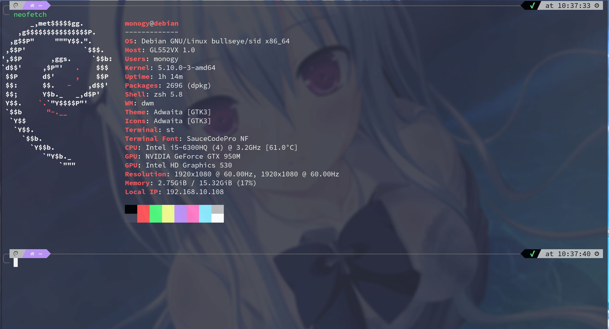

# 我的st终端模拟器

## 安装
	sudo make clean install 

## 补丁
	st-alpha-0.8.2.diff                       半透明效果 
	st-font2-20190416-ba72400.diff            解决彩色emoji配置下中文字体无法显示 
	st-anysize-20201003-407a3d0.diff          允许st调整到任何像素大小，使内部边框大小动态变化，并使终端内容居中
	st-dracula-0.8.2.diff                     基于Solarized的终端颜色
	st-hidecursor-0.8.3.diff                  键盘输入时自动隐藏鼠标
	st-desktopentry-0.8.2.diff                为st创建一个桌面图标 
	st-copyurl-20190202-0.8.1.diff            选择并复制url
	st-scrollback-20201205-4ef0cbd.diff       上/下滚动终端
	st-lukesmith-externalpipe(if_you_have_scrollback).diff
	st-blinking_cursor-20200531-a2a7044.diff  闪烁光标 
	st-w3m-0.8.3.diff                         w3m终端支持

## 快捷键
	ModMask  == Alt
	Mod1Mask == Win

| 命令                       | 功能                    |
|----------------------------|-------------------------|
| ModMask + l                | 复制url                 |
| ModMask + Down             | 向下滚动1行             |
| ModMask + Up               | 向上滚动1行             |
| ModMask + Shift + Down     | 向下滚动5行             |
| ModMask + Shift + Up       | 向上滚动5行             |

